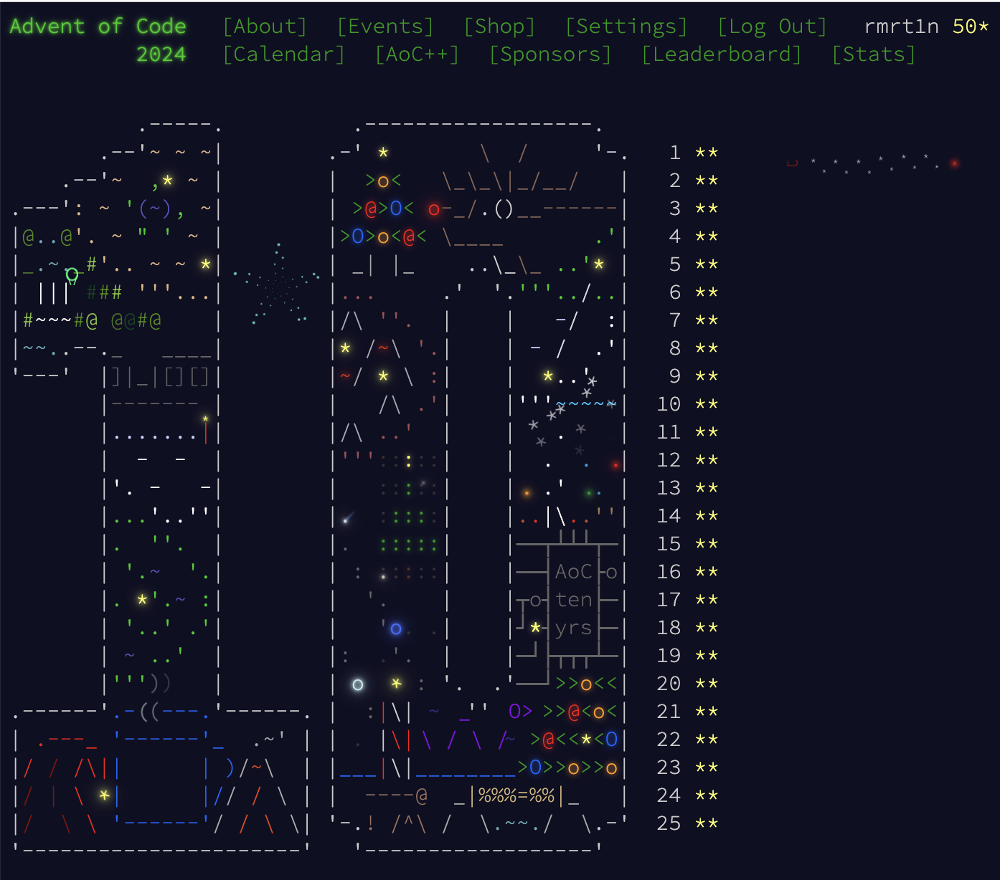
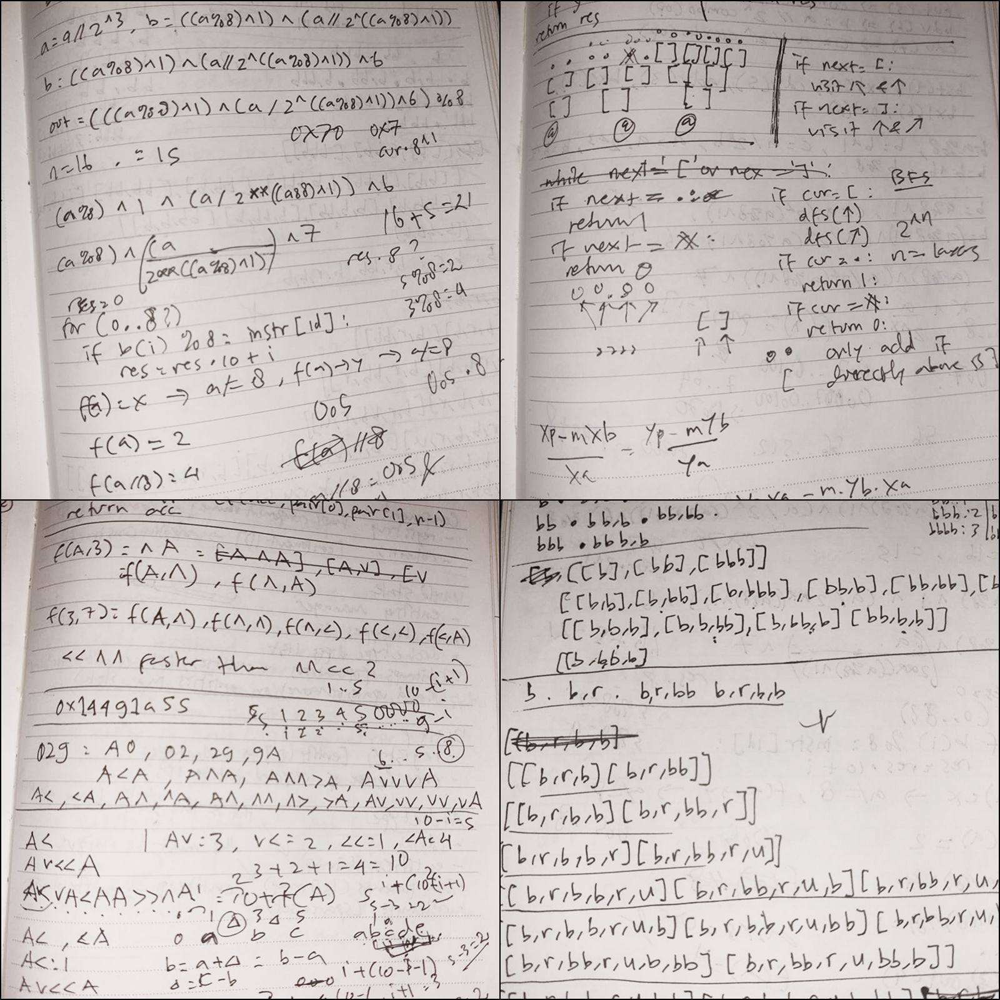

This post is about ~~six~~ seven months late, but here are my takeaways from [Advent of Code 2024](https://adventofcode.com/). It was my second time participating, and this time I actually managed to complete it.[^1] My goal was to learn a new language, [Zig](https://ziglang.org/), and to improve my DSA and problem-solving skills.

If you're not familiar, Advent of Code is an annual programming challenge that runs every December. A new puzzle is released each day from December 1st to the 25th. There's also a global leaderboard where people (and AI) race to get the fastest solves, but I personally don't compete in it, mostly because I want to do it at my own pace.

I went with Zig because I have been curious about it for a while, mainly because of its promise of [being a better C](https://www.youtube.com/watch?v=Gv2I7qTux7g) and because [TigerBeetle](https://tigerbeetle.com/) (one of the coolest databases now) is written in it. Learning Zig felt like a good way to get back into systems programming, something I've been wanting to do after a couple of chaotic years of web development.

This post is mostly about my setup, results, and the things I learned from solving the puzzles. If you're more interested in my solutions, I've also uploaded my code and solution write-ups to my [GitHub repository](https://github.com/rmrt1n/advent-of-code).



## Project Setup

There were [several Advent of Code templates in Zig](https://github.com/search?q=advent+of+code+template+lang%3Azig&type=repositories) that I looked at as a reference for my development setup, but none of them really clicked with me. I ended up just running my solutions directly using `zig run` for the whole event. It wasn't until after the event ended that I properly learned [Zig's build system](https://ziglang.org/learn/build-system/) and reorganised my project.

Here's what the project structure looks like now:

```plaintext
.
├── src
│   ├── days
│   │   ├── data
│   │   │   ├── day01.txt
│   │   │   ├── day02.txt
│   │   │   └── ...
│   │   ├── day01.zig
│   │   ├── day02.zig
│   │   └── ...
│   ├── bench.zig
│   └── run.zig
└── build.zig
```

The project is powered by `build.zig`, which defines several commands:

1. **Build**
    - `zig build` - Builds all of the binaries for all optimisation modes.
2. **Run**
    - `zig build run` - Runs all solutions sequentially.
    - `zig build run -Day=XX` - Runs the solution of the specified day only.
3. **Benchmark**
    - `zig build bench` - Runs all benchmarks sequentially.
    - `zig build bench -Day=XX` - Runs the benchmark of the specified day only.
4. **Test**
    - `zig build test` - Runs all tests sequentially.
    - `zig build test -Day=XX` - Runs the tests of the specified day only.

You can also pass the optimisation mode that you want to any of the commands above with the `-Doptimize` flag.

Under the hood, `build.zig` compiles `src/run.zig` when you call `zig build run`, and `src/bench.zig` when you call `zig build bench`. These files are templates that import the solution for a specific day from `src/days/dayXX.zig`. For example, here's what `src/run.zig` looks like:


```zig
const std = @import("std");
const puzzle = @import("day"); // Injected by build.zig

pub fn main() !void {
    var arena = std.heap.ArenaAllocator.init(std.heap.page_allocator);
    defer arena.deinit();
    const allocator = arena.allocator();

    std.debug.print("{s}\n", .{puzzle.title});
    _ = try puzzle.run(allocator, true);
    std.debug.print("\n", .{});
}
```


The `day` module imported is an [anonymous import](https://ziglang.org/learn/build-system/#generating-zig) dynamically injected by `build.zig` during compilation. This allows a single `run.zig` or `bench.zig` to be reused for all solutions. This avoids repeating boilerplate code in the solution files. Here's a simplified version of my `build.zig` file that shows how this works:


```zig
const std = @import("std");

pub fn build(b: *std.Build) void {
    const target = b.standardTargetOptions(.{});
    const optimize = b.standardOptimizeOption(.{});

    const run_all = b.step("run", "Run all days");
    const day_option = b.option(usize, "ay", ""); // The `-Day` option

    // Generate build targets for all 25 days.
    for (1..26) |day| {
        const day_zig_file = b.path(b.fmt("src/days/day{d:0>2}.zig", .{day}));

        // Create an executable for running this specific day.
        const run_exe = b.addExecutable(.{
            .name = b.fmt("run-day{d:0>2}", .{day}),
            .root_source_file = b.path("src/run.zig"),
            .target = target,
            .optimize = optimize,
        });

        // Inject the day-specific solution file as the anonymous module `day`.
        run_exe.root_module.addAnonymousImport("day", .{ .root_source_file = day_zig_file });

        // Install the executable so it can be run.
        b.installArtifact(run_exe);

        // ...
    }
}
```


My actual `build.zig` has some extra code that builds the binaries for all optimisation modes. 

This setup is pretty barebones. I've seen [other templates](https://github.com/fspoettel/advent-of-code-rust) do cool things like scaffold files, download puzzle inputs, and even submit answers automatically. Since I wrote my `build.zig` after the event ended, I didn't get to use it while solving the puzzles. I might add these features to it if I decided to do Advent of Code again this year with Zig.

## Self-Imposed Constraints

While there are no rules to Advent of Code itself, to make things a little more interesting, I set a few constraints and rules for myself:

1. **The code must be readable**.
    By "readable", I mean the code should be straightforward and easy to follow. No unnecessary abstractions. I should be able to come back to the code months later and still understand (most of) it.
2. **Solutions must be a single file**.
    No external dependencies. No shared utilities module. Everything needed to solve the puzzle should be visible in that one solution file.
3. **The total runtime must be under one second**.[^2]
    All solutions, when run sequentially, should finish in under one second. I want to improve my performance engineering skills.
4. **Parts should be solved separately**.
    This means: (1) no solving both parts simultaneously, and (2) no doing extra work in part one that makes part two faster. The aim of this is to get a clear idea of how long each part takes on its own.
5. **No concurrency or parallelism**.
    Solutions must run sequentially on a single thread. This keeps the focus on the efficiency of the algorithm. I can't speed up slow solutions by using multiple CPU cores.
6. **No ChatGPT. No Claude. No AI help**.
    I want to train myself, not the LLM. I can look at other people's solutions, but only after I have given my best effort at solving the problem.
7. **Follow the constraints of the input file**.
    The solution doesn't have to work for all possible scenarios, but it should work for all valid inputs. If the input file only contains 8-bit unsigned integers, the solution doesn't have to handle larger integer types.
8. **Hardcoding is allowed**.
    For example: size of the input, number of rows and columns, etc. Since the input is known at compile-time, we can skip runtime parsing and just embed it into the program using Zig's `@embedFile`.

Most of these constraints are designed to push me to write clearer, more performant code. I also wanted my code to look like it was taken straight from TigerBeetle's codebase (minus the assertions).[^3] Lastly, I just thought it would make the experience more fun.

## Favourite Puzzles

From all of the puzzles, here are my top 3 favourites:

1. **Day 6: Guard Gallivant** - This is my slowest day (in benchmarks), but also the one I learned the most from. Some of these learnings include: using vectors to represent directions, padding 2D grids, metadata packing, system endianness, etc.
2. **Day 17: Chronospatial Computer** - I love reverse engineering puzzles. I used to do a lot of these in CTFs during my university days. The best thing I learned from this day is the realisation that we can use different integer bases to optimise data representation. This helped improve my runtimes in the later days 22 and 23.
3. **Day 21: Keypad Conundrum** - This one was fun. My gut told me that it can be solved greedily by always choosing the best move. It was right. Though I did have to scroll Reddit for a bit to figure out the step I was missing, which was that you have to visit the farthest keypads first. This is also my longest solution file (almost 400 lines) because I hardcoded the best-moves table.

Honourable mention:

1. **Day 24: Crossed Wires** - Another reverse engineering puzzle. Confession: I didn't solve this myself during the event. After 23 brutal days, my brain was too tired, so I copied a random Python solution from Reddit. When I retried it later, it turned out to be pretty fun. I still couldn't find a solution I was satisfied with though.

## Programming patterns and Zig Tricks

During the event, I learned a lot about Zig and performance, and also developed some personal coding conventions. Some of these are Zig-specific, but most are universal and can be applied across languages. This section covers general programming and Zig patterns I found useful. The next section will focus on performance-related tips.

### Comptime

Zig's flagship feature, [`comptime`](https://kristoff.it/blog/what-is-zig-comptime/), is surprisingly useful. I knew Zig uses it for generics and that people do clever metaprogramming with it, but I didn't expect to be using it so often myself.

My main use for `comptime` was to generate puzzle-specific types. All my solution files follow the same structure, with a `DayXX` function that takes some parameters (usually the input length) and returns a puzzle-specific type, e.g.:


```zig
fn Day01(comptime length: usize) type {
    return struct {
        const Self = @This();
        
        left: [length]u32 = undefined,
        right: [length]u32 = undefined,

        fn init(input: []const u8) !Self {}

        // ...
    };
}
```


This lets me instantiate the type with a size that matches my input:


```zig
// Here, `Day01` is called with the size of my actual input.
pub fn run(_: std.mem.Allocator, is_run: bool) ![3]u64 {
    // ...
    const input = @embedFile("./data/day01.txt");
    var puzzle = try Day01(1000).init(input);
    // ...
}

// Here, `Day01` is called with the size of my test input.
test "day 01 part 1 sample 1" {
    var puzzle = try Day01(6).init(sample_input);
    // ...
}
```


This allows me to reuse logic across different inputs while still hardcoding the array sizes. Without `comptime`, I have to either create a separate function for all my different inputs or dynamically allocate memory because I can't hardcode the array size.

I also used `comptime` to shift some computation to compile-time to reduce runtime overhead. For example, on day 4, I needed a function to check whether a string matches either `"XMAS"` or its reverse, `"SAMX"`. A pretty simple function that you can write as a one-liner in Python:


```python
def matches(pattern, target):
    return target == pattern or target == pattern[::-1]
```


Typically a function like this requires some dynamic allocation to create the reversed string, since the length of the string is only known at runtime.[^4] For this puzzle, since the words to reverse are known at compile-time, we can do something like this:


```zig
fn matches(comptime word: []const u8, slice: []const u8) bool {
    var reversed: [word.len]u8 = undefined;
    @memcpy(&reversed, word);
    std.mem.reverse(u8, &reversed);
    return std.mem.eql(u8, word, slice) or std.mem.eql(u8, &reversed, slice);
}
```


This creates a separate function for each word I want to reverse.[^5] Each function has an array with the same size as the word to reverse. This removes the need for dynamic allocation and makes the code run faster. As a bonus, Zig also warns you when this word isn't compile-time known, so you get an immediate error if you pass in a runtime value.

### Optional Types

A common pattern in C is to return special sentinel values to denote missing values or errors, e.g. `-1`, `0`, or `NULL`. In fact, I did this on day 13 of the challenge:


```zig
// We won't ever get 0 as a result, so we use it as a sentinel error value.
fn count_tokens(a: [2]u8, b: [2]u8, p: [2]i64) u64 {
    const numerator = @abs(p[0] * b[1] - p[1] * b[0]);
    const denumerator = @abs(@as(i32, a[0]) * b[1] - @as(i32, a[1]) * b[0]);
    return if (numerator % denumerator != 0) 0 else numerator / denumerator;
}

// Then in the caller, skip if the return value is 0.
if (count_tokens(a, b, p) == 0) continue;
```


This works, but it’s easy to forget to check for those values, or worse, to accidentally treat them as valid results. Zig improves on this with [optional types](https://ziglang.org/documentation/master/#Optionals). If a function might not return a value, you can return `?T` instead of `T`. This also forces the caller to handle the `null` case. Unlike C, `null` isn't a pointer but a more general concept. Zig treats `null` as the absence of a value for any type, just like Rust's [`Option<T>`](https://doc.rust-lang.org/std/option/).

The `count_tokens` function can be refactored to:


```zig
// Return null instead if there's no valid result.
fn count_tokens(a: [2]u8, b: [2]u8, p: [2]i64) ?u64 {
    const numerator = @abs(p[0] * b[1] - p[1] * b[0]);
    const denumerator = @abs(@as(i32, a[0]) * b[1] - @as(i32, a[1]) * b[0]);
    return if (numerator % denumerator != 0) null else numerator / denumerator;
}

// The caller is now forced to handle the null case.
if (count_tokens(a, b, p)) |n_tokens| {
    // logic only runs when n_tokens is not null.
}
```


Zig also has a concept of [error unions](https://ziglang.org/documentation/master/#Error-Union-Type), where a function can return either a value or an error. In Rust, this is [`Result<T>`](https://doc.rust-lang.org/std/result/). You could also use error unions instead of optionals for `count_tokens`; Zig doesn't force a single approach. I come from Clojure where returning `nil` for an error or missing value is common.

### Grid Padding

This year has a lot of 2D grid puzzles (arguably too many). A common feature of grid-based algorithms is the out-of-bounds check. Here's what it usually looks like:


```zig
fn dfs(map: [][]u8, position: [2]i8) u32 {
    const x, const y = position;
    
    // Bounds check here.
    if (x < 0 or y < 0 or x >= map.len or y >= map[0].len) return 0;

    if (map[x][y] == .visited) return 0;
    map[x][y] = .visited;

    var result: u32 = 1;
    for (directions) | direction| {
        result += dfs(map, position + direction);
    }
    return result;
}
```


This is a typical recursive DFS function. After doing a lot of this, I discovered a nice trick that not only improves code readability, but also its performance. The trick here is to pad the grid with sentinel characters that mark out-of-bounds areas, i.e. add a border to the grid.

Here's an example from day 6:

```plaintext
Original map:               With borders added:
                            ************
....#.....                  *....#.....*
.........#                  *.........#*
..........                  *..........*
..#.......                  *..#.......*
.......#..        ->        *.......#..*
..........                  *..........*
.#..^.....                  *.#..^.....*
........#.                  *........#.*
#.........                  *#.........*
......#...                  *......#...*
                            ************
```

You can use any value for the border, as long as it doesn't conflict with valid values in the grid. With the border in place, the bounds check becomes a simple equality comparison:


```zig
const border = '*';

fn dfs(map: [][]u8, position: [2]i8) u32 {
    const x, const y = position;
    if (map[x][y] == border) { // We are out of bounds
        return 0;
    }
    // ...
}
```


This is much more readable than the previous code. Plus, it's also faster since we're only doing one equality check instead of four range checks.

That said, this isn't a one-size-fits-all solution. This only works for algorithms that traverse the grid one step at a time. If your logic jumps multiple tiles, it can still go out of bounds (except if you increase the width of the border to account for this). This approach also uses a bit more memory than the regular approach as you have to store more characters.

### SIMD Vectors

This could also go in the performance section, but I'm including it here because the biggest benefit I get from using SIMD in Zig is the improved code readability. Because Zig has first-class [support for vector types](https://ziglang.org/documentation/master/#Vectors), you can write elegant and readable code that also happens to be faster.

If you're not familiar with vectors, they are a special collection type used for [Single instruction, multiple data (SIMD)](https://en.wikipedia.org/wiki/Single_instruction,_multiple_data) operations. SIMD allows you to perform computation on multiple values in parallel using only a single CPU instruction, which often leads to some performance boosts.[^6]

I mostly use vectors to represent positions and directions, e.g. for traversing a grid. Instead of writing code like this:


```zig
next_position = .{ position[0] + direction[0], position[1] + direction[1] };
```


You can represent `position` and `direction` as 2-element vectors and write code like this:


```zig
next_position = position + direction;
```


This is much nicer than the previous version!

Day 25 is another good example of a problem that can be solved elegantly using vectors: 


```zig
var result: u64 = 0;
for (self.locks.items) |lock| { // lock is a vector
    for (self.keys.items) |key| { // key is also a vector
        const fitted = lock + key > @as(@Vector(5, u8), @splat(5));
        const is_overlap = @reduce(.Or, fitted);
        result += @intFromBool(!is_overlap);
    }
}
```


Expressing the logic as vector operations makes the code cleaner since you don't have to write loops and conditionals as you typically would in a traditional approach.

## Performance Tips

The tips below are general performance techniques that often help, but like most things in software engineering, "it depends". These might work 80% of the time, but performance is often highly context-specific. You should benchmark your code instead of blindly following what other people say.

This section would've been more fun with concrete examples, step-by-step optimisations, and benchmarks, but that would’ve made the post way too long. Hopefully I'll get to write something like that in the future.[^7]

### Minimise Allocations

Whenever possible, prefer static allocation. Static allocation is cheaper since it just involves moving the stack pointer vs dynamic allocation which has more overhead from the allocator machinery. That said, it's not always the right choice since it has some limitations, e.g. stack size is limited, memory size must be compile-time known, its lifetime is tied to the current stack frame, etc.

If you need to do dynamic allocations, try to reduce the number of times you call the allocator. The number of allocations you do matters more than the amount of memory you allocate. More allocations mean more bookkeeping, synchronisation, and sometimes syscalls.

A simple but effective way to reduce allocations is to reuse buffers, whether they're statically or dynamically allocated. Here's an example from day 10. For each trail head, we want to create a set of trail ends reachable from it. The naive approach is to allocate a new set every iteration:


```zig
for (self.trail_heads.items) |trail_head| {
    var trail_ends = std.AutoHashMap([2]u8, void).init(self.allocator);
    defer trail_ends.deinit();
    
    // Set building logic...
}
```


What you can do instead is to allocate the set once before the loop. Then, each iteration, you reuse the set by emptying it without freeing the memory. For Zig's `std.AutoHashMap`, this can be done using the `clearRetainingCapacity` method:


```zig
var trail_ends = std.AutoHashMap([2]u8, void).init(self.allocator);
defer trail_ends.deinit();

for (self.trail_heads.items) |trail_head| {
    trail_ends.clearRetainingCapacity();
    
    // Set building logic...
}
```


If you use static arrays, you can also just overwrite existing data instead of clearing it.  

A step up from this is to [reuse multiple buffers](https://en.wikipedia.org/wiki/Multiple_buffering). The simplest form of this is to reuse two buffers, i.e. double buffering. Here's an example from day 11:


```zig
// Initialize two hash maps that we'll alternate between.
var frequencies: [2]std.AutoHashMap(u64, u64) = undefined;
for (0..2) |i| frequencies[i] = std.AutoHashMap(u64, u64).init(self.allocator);
defer for (0..2) |i| frequencies[i].deinit();

var id: usize = 0;
for (self.stones) |stone| try frequencies[id].put(stone, 1);

for (0..n_blinks) |_| {
    var old_frequencies = &frequencies[id % 2];
    var new_frequencies = &frequencies[(id + 1) % 2];
    id += 1;

    defer old_frequencies.clearRetainingCapacity();

    // Do stuff with both maps...
}
```


Here we have two maps to count the frequencies of stones across iterations. Each iteration will build up `new_frequencies` with the values from `old_frequencies`. Doing this reduces the number of allocations to just 2 (the number of buffers). The tradeoff here is that it makes the code slightly more complex.

### Make Your Data Smaller

A performance tip people say is to have "mechanical sympathy". Understand how your code is processed by your computer. An example of this is to structure your data so it works better with your CPU. For example, keep related data close in memory to take advantage of [cache locality](https://en.algorithmica.org/hpc/external-memory/locality/).

Reducing the size of your data helps with this. Smaller data means more of it can fit in cache. One way to shrink your data is through [bit packing](https://www.cs.cornell.edu/courses/cs3410/2024fa/notes/bitpack.html). This depends heavily on your specific data, so you'll need to use your judgement to tell whether this would work for you. I'll just share some examples that worked for me.

The first example is in day 6 part two, where you have to detect a loop, which happens when you revisit a tile from the same direction as before. To track this, you could use a map or a set to store the tiles and visited directions. A more efficient option is to store this direction metadata in the tile itself.

There are only four tile types, which means you only need two bits to represent the tile types as an enum. If the enum size is one byte, here's what the tiles look like in memory:

```plaintext
.obstacle -> 00000000
.path     -> 00000001
.visited  -> 00000010
.path     -> 00000011
```

As you can see, the upper six bits are unused. We can store the direction metadata in the upper four bits. One bit for each direction. If a bit is set, it means that we've already visited the tile in this direction. Here's an illustration of the memory layout:

```plaintext
        direction metadata   tile type
           ┌─────┴─────┐   ┌─────┴─────┐
┌────────┬─┴─┬───┬───┬─┴─┬─┴─┬───┬───┬─┴─┐
│ Tile:  │ 1 │ 0 │ 0 │ 0 │ 0 │ 0 │ 1 │ 0 │
└────────┴─┬─┴─┬─┴─┬─┴─┬─┴───┴───┴───┴───┘
   up bit ─┘   │   │   └─ left bit
    right bit ─┘ down bit
```

If your language supports struct packing, you can express this layout directly:[^8]


```zig
const Tile = packed struct(u8) {
    const TileType = enum(u4) { obstacle, path, visited, exit };

    up: u1 = 0,
    right: u1 = 0,
    down: u1 = 0,
    left: u1 = 0,
    tile: TileType,

    // ...
}
```


Doing this avoids extra allocations and improves cache locality. Since the directions metadata is colocated with the tile type, all of them can fit together in cache. Accessing the directions just requires some bitwise operations instead of having to fetch them from another region of memory. 

Another way to do this is to represent your data using [alternate number bases](https://en.wikipedia.org/wiki/Numeral_system#Positional_systems_in_detail). Here's an example from day 23. Computers are represented as two character strings made up of only lowercase letters, e.g. `"bc"`, `"xy"`, etc. Instead of storing this as a `[2]u8` array, you can convert it into a base-26 number and store it as a `u16`.[^9]

Here’s the idea: map `'a'` to 0, `'b'` to 1, up to `'z'` as 25. Each character in the string becomes a digit in the base-26 number. For example,  `"bc"` ( `[2]u8{ 'b', 'c' }`) becomes the base-10 number 28 ($1 × 26 + 2 = 28$). If we represent this using the base-64 character set, it becomes 12 (`'b'` = 1, `'c'` = 2).

While they take the same amount of space (2 bytes), a `u16` has some benefits over a `[2]u8`:

1. It fits in a single register, whereas you need two for the array.
2. Comparison is faster as there is only a single value to compare.

### Reduce Branching

I won't explain branchless programming here; [the Algorithmica's page](https://en.algorithmica.org/hpc/pipelining/branchless/) explains it way better than I can. While modern compilers are often smart enough to compile away branches, they don't catch everything. I still recommend writing branchless code whenever it makes sense. It also has the added benefit of reducing the number of [codepaths in your program](https://www.rfleury.com/p/the-codepath-combinatoric-explosion).

Again, since performance is very context-dependent, I'll just show you some patterns I use. Here's one that comes up often:


```zig
if (is_valid_report(report)) {
    result += 1;
}
```


Instead of the branch, cast the bool into an integer directly:


```zig
result += @intFromBool(is_valid_report(report))
```


Another example is from day 6 (again!). Recall that to know if a tile has been visited from a certain direction, we have to check its direction bit. Here's one way to do it:


```zig
fn has_visited(tile: Tile, direction: Direction) bool {
    switch (direction) {
        .up => return self.up == 1,
        .right => return self.right == 1,
        .down => return self.down == 1,
        .left => return self.left == 1,
    }
}
```


This works, but it introduces a few branches. We can make it branchless using bitwise operations:


```zig
fn has_visited(tile: Tile, direction: Direction) bool {
    const int_tile = std.mem.nativeToBig(u8, @bitCast(tile));
    const mask = direction.mask();
    const bits = int_tile & 0xff; // Get only the direction bits
    return bits & mask == mask;
}
```


While this is arguably cryptic and less readable, it does perform better than the switch version.

### Avoid Recursion

The final performance tip is to prefer iterative code over recursion. Recursive functions bring the overhead of allocating stack frames. While recursive code is more elegant, it's also often slower unless your language's compiler can optimise it away, e.g. via tail-call optimisation. As far as I know, Zig doesn't have this, though I might be wrong.

Recursion also has the risk of causing a stack overflow if the execution isn't bounded. This is why code that is mission- or safety-critical avoids recursion entirely. It's in TigerBeetle's [TIGERSTYLE](https://github.com/tigerbeetle/tigerbeetle/blob/main/docs/TIGER_STYLE.md) and also NASA's [Power of Ten](https://spinroot.com/gerard/pdf/P10.pdf).

Iterative code can be harder to write in some cases, e.g. DFS maps naturally to recursion, but most of the time it is significantly faster, more predictable, and safer than the recursive alternative.

## Benchmarks

I ran benchmarks for all 25 solutions in each of Zig’s optimisation modes. You can find the full results and the benchmark script in my [GitHub repository](https://github.com/rmrt1n/advent-of-code). All benchmarks were done on an [Apple M3 Pro](https://en.wikipedia.org/wiki/Apple_M3).

As expected, `ReleaseFast` produced the best result with a total runtime of **85.1 ms**. I'm quite happy with this, considering the two constraints that limited the number of optimisations I can do to the code:

- **Parts should be solved separately** - Some days can be solved in a single go, e.g. day 10 and day 13, which could've saved a few milliseconds. 
- **No concurrency or parallelism** - My slowest days are the compute-heavy days that are very easily parallelisable, e.g. day 6, day 19, and day 22. Without this constraint, I can probably reach sub-20 milliseconds total(?), but that's for another time.

You can see the full benchmarks for `ReleaseFast` in the table below:



| Day | Title                  | Parsing (µs) | Part 1 (µs) | Part 2 (µs) | Total (µs)     |
| --- | ---------------------- | -----------: | ----------: | ----------: | -------------: |
|  1  | Historian Hysteria     | 23.5         | 15.5        | 2.8         | **41.8**       |
|  2  | Red-Nosed Reports      | 42.9         | 0.0         | 11.5        | **54.4**       |
|  3  | Mull it Over           | 0.0          | 7.2         | 16.0        | **23.2**       |
|  4  | Ceres Search           | 5.9          | 0.0         | 0.0         | **5.9**        |
|  5  | Print Queue            | 22.3         | 0.0         | 4.6         | **26.9**       |
|  6  | Guard Gallivant        | 14.0         | 25.2        | 24,331.5    | **24,370.7**   |
|  7  | Bridge Repair          | 72.6         | 321.4       | 9,620.7     | **10,014.7**   |
|  8  | Resonant Collinearity  | 2.7          | 3.3         | 13.4        | **19.4**       |
|  9  | Disk Fragmenter        | 0.8          | 12.9        | 137.9       | **151.7**      |
| 10  | Hoof It                | 2.2          | 29.9        | 27.8        | **59.9**       |
| 11  | Plutonian Pebbles      | 0.1          | 43.8        | 2,115.2     | **2,159.1**    |
| 12  | Garden Groups          | 6.8          | 164.4       | 249.0       | **420.3**      |
| 13  | Claw Contraption       | 14.7         | 0.0         | 0.0         | **14.7**       |
| 14  | Restroom Redoubt       | 13.7         | 0.0         | 0.0         | **13.7**       |
| 15  | Warehouse Woes         | 14.6         | 228.5       | 458.3       | **701.5**      |
| 16  | Reindeer Maze          | 12.6         | 2,480.8     | 9,010.7     | **11,504.1**   |
| 17  | Chronospatial Computer | 0.1          | 0.2         | 44.5        | **44.8**       |
| 18  | RAM Run                | 35.6         | 15.8        | 33.8        | **85.2**       |
| 19  | Linen Layout           | 10.7         | 11,890.8    | 11,908.7    | **23,810.2**   |
| 20  | Race Condition         | 48.7         | 54.5        | 54.2        | **157.4**      |
| 21  | Keypad Conundrum       | 0.0          | 1.7         | 22.4        | **24.2**       |
| 22  | Monkey Market          | 20.7         | 0.0         | 11,227.7    | **11,248.4**   |
| 23  | LAN Party              | 13.6         | 22.0        | 2.5         | **38.2**       |
| 24  | Crossed Wires          | 5.0          | 41.3        | 14.3        | **60.7**       |
| 25  | Code Chronicle         | 24.9         | 0.0         | 0.0         | **24.9**       |


A weird thing I found when benchmarking is that for day 6 part two, `ReleaseSafe` actually ran faster than `ReleaseFast` (13,189.0 µs vs 24,370.7 µs). Their outputs are the same, but for some reason `ReleaseSafe` is faster even with the safety checks still intact.

The Zig compiler is still very much a moving target, so I don't want to dig too deep into this, as I'm guessing this might be a bug in the compiler. This weird behaviour might just disappear after a few compiler version updates.

## Reflections

Looking back, I'm really glad I decided to do Advent of Code and followed through to the end. I learned a lot of things. Some are useful in my professional work, some are more like random bits of trivia. Going with Zig was a good choice too. The language is small, simple, and gets out of your way. I learned more about algorithms and concepts than the language itself.

Besides what I've already mentioned earlier, here are some examples of the things I learned:

- The concept of [Manhattan distance](https://en.wikipedia.org/wiki/Taxicab_geometry).
- [Cliques](https://en.wikipedia.org/wiki/Bron%E2%80%93Kerbosch_algorithm) and the [Bron-Kerbosch algorithm](https://en.wikipedia.org/wiki/Bron%E2%80%93Kerbosch_algorithm).
- The [ripple-carry adder circuit](https://en.wikipedia.org/wiki/Adder_(electronics)#Ripple-carry_adder).
- LaTeX math syntax with [MathJax](https://docs.github.com/en/get-started/writing-on-github/working-with-advanced-formatting/writing-mathematical-expressions), which I used in my write-ups.
- In Python, you can use [complex numbers to traverse 2D grids](https://www.alpinewerk.com/posts/complex/)!

Some of my self-imposed constraints and rules ended up being helpful. I can still (mostly) understand the code I wrote a few months ago. Putting all of the code in a single file made it easier to read since I don't have to context switch to other files all the time.

However, some of them did backfire a bit, e.g. the two constraints that limit how I can optimise my code. Another one is the "hardcoding allowed" rule. I used a lot of magic numbers, which helped to improve performance, but I didn't document them so after a while I don't even remember how I got them. I've since gone back and added explanations in my write-ups, but next time I'll remember to at least leave comments.

One constraint I'll probably remove next time is the no concurrency rule. It's the biggest contributor to the total runtime of my solutions. I don't do a lot of concurrent programming, even though my main language at work is Go, so next time it might be a good idea to use Advent of Code to level up my concurrency skills.

I also spent way more time on these puzzles than I originally expected. I optimised and rewrote my code multiple times. I also rewrote my write-ups a few times to make them easier to read. This is by far my longest side project yet. It's a lot of fun, but it also takes a lot of time and effort. I almost gave up on the write-ups (and this blog post) because I don't want to explain my awful day 15 and day 16 code. I ended up taking a break for a few months before finishing it, which is why this post is published in August lol.

Just for fun, here's a photo of some of my notebook sketches that helped me visualise my solutions. See if you can guess which days these are from:



## What's Next?

So... would I do it again? Probably, though I'm not making any promises. If I do join this year, I'll probably stick with Zig. I had my eyes on Zig since the start of 2024, so Advent of Code was the perfect excuse to learn it. This year, there aren't any languages in particular that caught my eye, so I'll just keep using Zig, especially since I have a proper setup ready.

If you haven't tried Advent of Code, I highly recommend checking it out this year. It's a great excuse to learn a new language, improve your problem-solving skills, or just to learn something new. If you're eager, you can also do the [previous years' puzzles](https://adventofcode.com/2024/events) as they're still available.

One of the best aspects of Advent of Code is the community. The [Advent of Code subreddit](https://adventofcode.com/2024/events) is a great place for discussion. You can ask questions and also see other people's solutions. Some people also post really cool visualisations like [this one](https://www.reddit.com/r/adventofcode/s/nylBX7xFbp). They also have [memes!](https://www.reddit.com/r/adventofcode/?f=flair_name%3A%22Meme%2FFunny%22)

[^1]: I failed my first attempt horribly with [Clojure](https://clojure.org/) during Advent of Code 2023. Once I reached the later half of the event, I just couldn't solve the problems with a purely functional style. I could've pushed through using imperative code, but I stubbornly chose not to and gave up...

[^2]: The original constraint was that each solution must run in under one second. As it turned out, the code was faster than I expected, so I increased the difficulty.

[^3]: TigerBeetle's code quality and [engineering principles](https://github.com/tigerbeetle/tigerbeetle/blob/main/docs/TIGER_STYLE.md) are just wonderful.

[^4]: You can implement this function without any allocation by mutating the string in place or by iterating over it twice, which is probably faster than my current implementation. I kept it as-is as a reminder of what `comptime` can do.

[^5]:  As a bonus, I was curious as to what this looks like compiled so I listed all the functions in this binary in GDB and found:

    ```plaintext
    72:     static bool day04.Day04(140).matches__anon_19741;
    72:     static bool day04.Day04(140).matches__anon_19750;
    ```

    It does generate separate functions!
    
[^6]: Well, not always. The number of SIMD instructions depends on the machine's native SIMD size. If the length of the vector exceeds it, Zig will compile it into multiple SIMD instructions.

[^7]: Here's a nice [post on optimising day 9's solution with Rust](https://cprimozic.net/blog/optimizing-advent-of-code-2024/). It's a good read if you're into performance engineering or Rust techniques.

[^8]: One thing about packed structs is that their layout is dependent on the system endianness. Most modern systems are little-endian, so the memory layout I showed is actually reversed. Thankfully, Zig has some useful functions to convert between endianness like `std.mem.nativeToBig`, which makes working with packed structs easier.

[^9]: Technically, you can store 2-digit base 26 numbers in a `u10`, as there are only $26^2$ possible numbers. Most systems usually pad values by byte size, so `u10` will still be stored as `u16`, which is why I just went straight for it.
