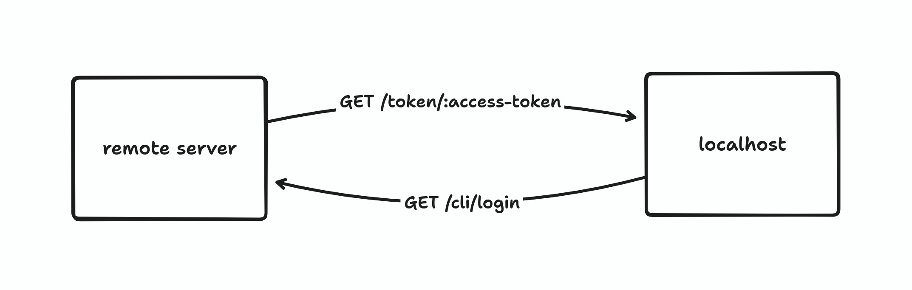
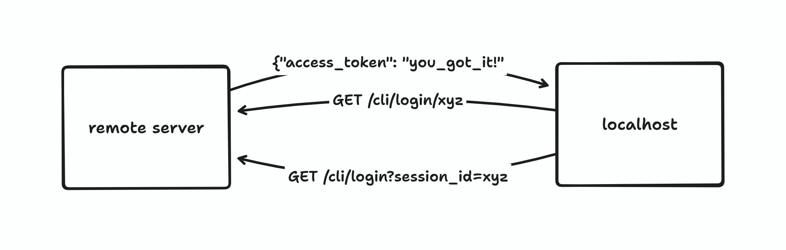
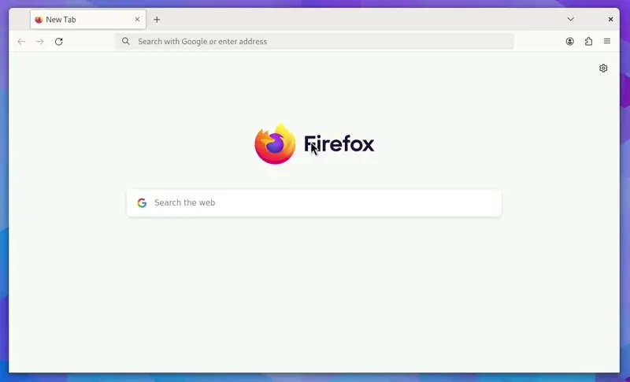
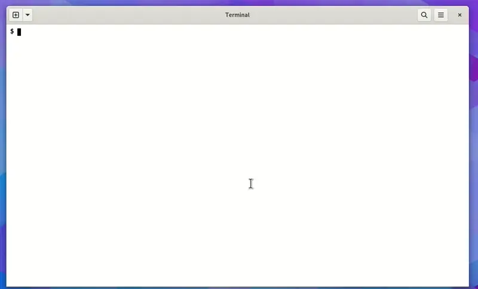
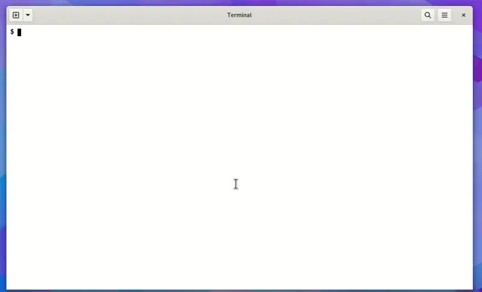

I've recently had the chance to work on an "automatic CLI login" feature for a [CLI tool](https://github.com/Argus-Labs/world-cli) at my day job. What I mean by automatic CLI login here is when a CLI tool automatically logs in a user, so it can perform actions on behalf of the user.

It usually works like this. When you type a command like `cli login` in your terminal, a login page will open in your web browser. After you log in, the page will show a message like "Your CLI is connected now". When you go back to the terminal, it will say that it's "connected" and you can now perform commands that require authentication.

The connection here is often in the form of an access token or an API key. This allows the CLI to stay logged in and perform authenticated requests to a remote server.

You've probably experienced this type of interaction before. Many modern CLI tools have some sort of command to allow you to log in from the command line. Examples include [Supabase CLI](https://supabase.com/docs/reference/cli/introduction), [GitHub CLI](https://cli.github.com/), [Graphite CLI](https://graphite.dev/features/cli), and Fly.io's [`flyctl`](https://fly.io/docs/flyctl/). It's a UX pattern that I like, as it hides a lot of complexity from the user.

There are probably many different ways to implement this, each with different trade-offs. In this post, I'll write about just one way of doing this, which is also the same approach used by Supabase and Fly.io.[^1] It works for my particular use case and does not require refactoring my existing authentication logic.

## How it Works

At first glance, it looks like there is a two-way communication between the CLI tool and the browser. When you log in to the browser, you'll receive an access token. Then the browser sends it to the CLI in some way?. Maybe the CLI starts up an HTTP server with an endpoint to receive the access token from the web page like the diagram below?



This probably works, though I haven't actually tested it yet. This isn't the approach that I implemented, but it could be a good area for future experimentation.

How it works in Supabase CLI and `flyctl` is that it uses a "one-way" communication scheme instead of a two-way one.[^2] Instead of the remote server sending the access token after the user has logged in, the CLI will keep polling for the access token in the background. At a high level, the flow should look like this diagram:



The CLI will provide a session ID and ask the server to create a "CLI login session" when the user logs in successfully. An access token will be created for this specific session. Then, the CLI will request this access token from the server and store it for future requests.

Since this approach uses [regular HTTP polling](https://javascript.info/long-polling#regular-polling), it's a potential source of [DDOS attacks](https://en.wikipedia.org/wiki/Denial-of-service_attack). In a perfect world, a user needs to login to the CLI only once after they install the tool. The server is unlikely to get too many login requests at a time. In the real world, attackers can keep sending login requests to the server to slow or take it down. We can mitigate this by rate-limiting the endpoints and blocking malicious IP addresses, but it's not a perfect defence.

This is a trade-off between security and code simplicity. HTTP polling is much simpler to implement than other solutions like [WebSockets](https://developer.mozilla.org/en-US/docs/Web/API/WebSockets_API) or [SSE](https://developer.mozilla.org/en-US/docs/Web/API/Server-sent_events/Using_server-sent_events). This might not work for you depending on your [threat model](https://en.wikipedia.org/wiki/Threat_model). But hey, if it works for Supabase, which has around 450,000 users,[^3] it'll probably work for me too.

Now that we know how it works, let's get into the code implementation. I'll build a web server and a CLI tool for a fictional developer tools company, ACME Corp. The CLI tool will be called `acme`.

## Project Setup

I'll use [SvelteKit](https://kit.svelte.dev) for this project, but the concepts apply to any web framework. I'll try to avoid using any svelte-specific features or terminologies so that you can apply this to any language or web framework you like.

```bash
# create a new sveltekit project & install dependencies
__$ pnpm create svelte@latest acme
__$ cd acme
__$ pnpm install
```

I've heard good things about [Drizzle ORM](https://orm.drizzle.team/), so I'll also use it as the ORM for this project. The database will be [SQLite](https://www.sqlite.org/) using the [`better-sqlite3`](https://github.com/WiseLibs/better-sqlite3/) library. We'll need to install these too.

```bash
__$ pnpm add drizzle-orm better-sqlite3
__$ pnpm add -D drizzle-kit
```

Drizzle requires some setup steps before we can use it. First, we'll create a Drizzle client:

```javascript
// src/lib/db/db.js
import Database from 'better-sqlite3'
import { drizzle } from 'drizzle-orm/better-sqlite3'

const sqlite = new Database('data/database.db')

export const db = drizzle(sqlite)
```

And define the database schema:

```javascript
// src/lib/db/schema.js
import { sqliteTable, text } from 'drizzle-orm/sqlite-core'

export const users = sqliteTable('users', {
  userId: text('user_id')
    .primaryKey()
    .$defaultFn(() => crypto.randomUUID()),
  email: text('email').unique().notNull(),
  password: text('password').notNull(),
})

export const sessions = sqliteTable('sessions', {
  sessionId: text('session_id')
    .primaryKey()
    .$defaultFn(() => crypto.randomUUID()),
  userId: text('user_id')
    .notNull()
    .references(() => users.userId),
})
```

The `users` table will store the user details, and the `sessions` table will store the authentication sessions. The app will use traditional [session-based authentication](https://roadmap.sh/guides/session-based-authentication).

Then, we need to update the config file:

```javascript
// drizzle.config.js
import { defineConfig } from 'drizzle-kit'

export default defineConfig({
  dialect: 'sqlite',
  schema: './src/lib/db/schema.js',
  dbCredentials: {
    url: './data/database.db',
  },
})
```

To apply the changes to the database, run:

```bash
# create database directory
__$ mkdir data

# apply changes to database
__$ pnpm drizzle-kit push
```

This will create the `data/database.db` SQLite database with our schema. You should only use `drizzle-kit push` for prototyping or local development. If you need database migrations, use `drizzle-kit generate` and `drizzle-kit migrate`. See the [official documentation](https://orm.drizzle.team/kit-docs/overview#prototyping-with-db-push) for more info.

Finally, start the development server by running `pnpm dev`. The server should now be running at `http://localhost:5173`.

## A Basic Authentication System

As the focus of this post is on automatic CLI login, we won't be doing anything fancy with user authentication. It'll use a database-backed session-based authentication. I'll also skip hashing the password and just store it in plaintext. You should never store passwords like this in a production system. Either use a third-party authentication service or follow the [OWASP guide to password storage](https://cheatsheetseries.owasp.org/cheatsheets/Password_Storage_Cheat_Sheet.html).

First, let's build a login page. For this app, the login page will serve as both the login and the signup page.[^4]

```html
<!-- src/routes/login/+page.svelte -->
<h1>log in</h1>
<form method="POST">
  <div>
    <label for="email">email</label>
    <input required id="email" name="email" type="email" placeholder="john.doe@email.com" />
  </div>
  <div>
    <label for="password">password</label>
    <input required id="password" name="password" type="password" />
  </div>
  <button>log in</button>
</form>
```

The login form sends a POST request with the user's email and password to this handler:

```javascript
// src/routes/login/+page.server.js
import { db } from '$lib/db/db'
import { sessions, users } from '$lib/db/schema'
import { fail, redirect } from '@sveltejs/kit'
import { eq } from 'drizzle-orm'

/** @type {import('./$types').Actions} */
export const actions = {
  default: async ({ request, cookies, url }) => {
    const form = await request.formData()
    const email = form.get('email')
    const password = form.get('password')

    if (!email || !password) {
      return fail(400, { message: 'missing email or password' })
    }

    const userData = await db.select().from(users).where(eq(users.email, email))
    const user = userData[0]
    const next = url.searchParams.get('next') ?? '/'

    // register user if not exists & create session
    if (!user) {
      const newUserData = await db.insert(users).values({ email, password }).returning()
      const session = await db
        .insert(sessions)
        .values({ userId: newUserData[0].userId })
        .returning()
      cookies.set('session', session[0].sessionId, { path: '/' })
      redirect(303, next)
    }

    // else login
    if (email === user.email && password === user.password) {
      const session = await db.insert(sessions).values({ userId: user.userId }).returning()
      cookies.set('session', session[0].sessionId, { path: '/' })
      redirect(303, next)
    }

    return fail(400, { message: 'invalid email or password' })
  },
}
```

The exported `actions` map is [SvelteKit's version of form action handlers](https://kit.svelte.dev/docs/form-actions). You can just focus on the function in the `default` action.

If the user record doesn't exist in the database, this function will create a new user and session in the database, set the required cookie in the response header, and redirect the user to the value in the `next` search param. If `next` is not specified, it will redirect to the home page instead. If the user is already registered, it will directly create the session, set the cookie, and redirect the user.

We'll also add route protection to the home page. Unauthenticated requests to the home page will be redirected to the login page.

```javascript
// src/routes/+page.server.js
import { db } from '$lib/db/db'
import { sessions, users } from '$lib/db/schema'
import { redirect } from '@sveltejs/kit'
import { eq } from 'drizzle-orm'

/** @type {import('./$types').PageServerLoad} */
export async function load({ cookies }) {
  const sessionCookie = cookies.get('session')
  if (!sessionCookie) redirect(302, '/login')

  const sessionData = await db.select().from(sessions).where(eq(sessions.sessionId, sessionCookie))
  const session = sessionData[0]
  if (!session) redirect(302, '/login')

  const user = await db.select().from(users).where(eq(users.userId, session.userId))

  return {
    user: user[0],
  }
}
```

The `load` function is a [function that runs before the page is rendered](https://kit.svelte.dev/docs/load). It's similar to page/route controllers in other web frameworks like [Django](https://www.djangoproject.com/) and [Ruby on Rails](https://rubyonrails.org/). If you open `http://localhost:5173` in your browser, you should be redirected to the login page.



## The CLI Login Endpoints

Now let's get to the main focus of this article. We'll need to add new tables in our database schema to support this feature:

```javascript
// src/lib/db/schema.js
// ...

export const accessTokens = sqliteTable('access_tokens', {
  tokenId: text('token_id')
    .primaryKey()
    .$defaultFn(() => crypto.randomUUID()),
  userId: text('user_id')
    .notNull()
    .references(() => users.userId),
})

export const cliSessions = sqliteTable('cli_sessions', {
  cliSessionId: text('cli_session_id')
    .primaryKey()
    .$defaultFn(() => crypto.randomUUID()),
  tokenId: text('token_id')
    .notNull()
    .references(() => accessTokens.tokenId),
})
```

The `access_tokens` table will store the users' access tokens, while the `cli_sessions` table will store the "login sessions" triggered by the CLI tool. When a user runs the command `acme login`, it will trigger a login session and an access token to be created in the server.

Run `pnpm drizzle-kit push` again to apply the changes to the database. If you encounter a SQLite read-only error in the SvelteKit, just restart the dev server.

We'll also need to add new endpoints, `/cli/login` and `cli/login/:session`. Before we implement these endpoints, we'll need a page to show the "Your CLI is now connected" message once the user has logged in.

```html
<!-- src/routes/cli/login/+page.svelte -->
<p>You're CLI is connected now. you can close this tab</p>
```

Now, here's the code for the `/cli/login` route handler:

```javascript
// src/routes/cli/login/+page.server.js
import { db } from '$lib/db/db'
import { accessTokens, cliSessions, sessions, users } from '$lib/db/schema'
import { error, redirect } from '@sveltejs/kit'
import { eq } from 'drizzle-orm'

/** @type {import('./$types').PageServerLoad} */
export async function load({ cookies, url }) {
  const sessionCookie = cookies.get('session')
  const next = encodeURIComponent(url.pathname + url.search)

  if (!sessionCookie) redirect(302, `/login?next=${next}`)

  const sessionData = await db.select().from(sessions).where(eq(sessions.sessionId, sessionCookie))
  const session = sessionData[0]

  // if there is no valid session, redirect to login
  if (!session) redirect(302, `/login?next=${next}`)

  // get user from session id
  const userData = await db
    .select()
    .from(users)
    .leftJoin(sessions, eq(users.userId, sessions.userId))
    .where(eq(sessions.sessionId, sessionCookie))
  const user = userData[0].users

  const params = url.searchParams
  const cliSessionId = params.get('session')

  if (!cliSessionId) {
    return error(400, { message: 'missing search params' })
  }

  const cliSessionData = await db
    .select()
    .from(cliSessions)
    .where(eq(cliSessions.cliSessionId, cliSessionId))
  const cliSession = cliSessionData[0]

  // create cli session & access token if it doesn't exist
  if (!cliSession) {
    const token = await db.insert(accessTokens).values({ userId: user.userId }).returning()
    await db.insert(cliSessions).values({ cliSessionId, tokenId: token[0].tokenId })
  }
}
```

This function first checks if the user is logged in using the cookie. The mechanism is the almost same as in the home page, with the only difference being that we're setting the `next` search parameter to point back to this URL. This will redirect the user back to `/cli/login` after they have logged in.

If the user is already logged in,  a CLI session and an access token will be inserted into the database. Then, it'll render the success message page from before. Note, in SvelteKit, after the `load` function in `+page.server.js` is called, the page in `+page.svelte` will be rendered. That's why we don't have to tell this function to render the page.

Next is the `/cli/login/:session` route handler:

```javascript
// src/routes/cli/login/[session]/+server.js
import { db } from '$lib/db/db'
import { cliSessions } from '$lib/db/schema'
import { error } from '@sveltejs/kit'
import { eq } from 'drizzle-orm'

/** @type {import('./$types').RequestHandler} */
export async function GET({ params }) {
  const { session } = params

  const cliSessionData = await db
    .select()
    .from(cliSessions)
    .where(eq(cliSessions.cliSessionId, session))
  const cliSession = cliSessionData[0]

  if (!cliSession) return error(404)

  return Response.json({ token: cliSession.tokenId })
}
```

This function checks if the session in the URL's path param is a valid CLI session in the database. If it is, it'll return the access token in the response body. This token will then be stored by the CLI tool and used in subsequent requests.

## Writing the CLI Tool

Our `acme` CLI tool will just be a single Node.js script. It'll have only one command, `acme login`. As mentioned in the previous section, the CLI will request a login session and poll for the access token:

```javascript
// acme.js
import crypto from 'crypto'
import { exec } from 'child_process'

const [_node, _acme, argv1] = process.argv

// exit if program isn't run with the login command
if (!argv1 || argv1 !== 'login') {
  console.log('usage: node acme.js login')
  process.exit(1)
}

const host = 'http://localhost:5173'
const session = crypto.randomUUID()

// open the URL in the default browser
const url = `${host}/cli/login?session=${session}`
exec(`xdg-open '${url}'`, () => console.log(`Here's your login link:\n\n${url}\n`))

// poll for the access token
const interval = setInterval(() => {
  fetch(`${host}/cli/login/${session}`)
    .then((res) => (res.ok ? res.json() : null))
    .then((data) => {
      if (!data) return

      console.log(data)

      clearInterval(interval)
    })
}, 1000)
```

The `acme` CLI will generate a random UUID for the session ID and include it as a search parameter in a URL to `/cli/login`. Then, it'll call `exec`, which will run an OS process. In my case, it uses `xdg-open`, a Linux program that opens a file or URL with the user's default application. If you're using a Mac, replace this with `open`, and if you're on Windows, replace it with `start`.

If you're not already logged in, you will be redirected to the login page. Once you've logged in and seen the success message, the CLI should have already received the access token from the `/cli/login/:session` endpoint. If you run this script, you should get something like this:



Nice! We now have a working automatic CLI login system. Note, I cleared the cookies in the video above so that I can log in again. If you didn't do this, you'll go straight to the success message as you're already logged in. I also created a shell alias to make the script look like a "proper" CLI tool:

```bash
# create the alias
__$ alias acme='node acme.js'

# then you can run
__$ acme login
```

## Security Considerations

I've mentioned DDOS attacks before as one of the vulnerabilities of this login flow. I'll mention a few more and also explain the ways to mitigate it. This isn't a comprehensive list of security vulnerabilities though. You might need to conduct security tests or assessments depending on your threat model.

One type of attack we're vulnerable to is the [man-in-the-middle attack](https://en.wikipedia.org/wiki/Man-in-the-middle_attack). A man-in-the-middle attack can happen when we try to log in over an insecure connection. An attacker can listen to your network traffic and steal your access tokens. Thankfully this kind of attack is easy to mitigate by using a secure connection like HTTPS. HTTPS encrypts your network traffic, preventing a third party from reading your network activity.

Another kind of attack is a [brute force attack](https://en.wikipedia.org/wiki/Brute-force_attack). Since the endpoints to poll for the access tokens don't require authentication, attackers can brute force UUID values until they get an access token. This can be mitigated by expiring the CLI sessions and applying the same strategies as with DDOS attacks.

Both of these attacks have one thing in common. If an attacker gets a hold of your access token, you're hacked. We can increase the security of our app by encrypting the access tokens. This way, even if attackers obtain an encrypted access token, they won't be able to decrypt it.

Encrypting the tokens presents some challenges. How do we ensure that only the CLI can decrypt the token? What encryption scheme should be used? What if an attacker obtained the decryption key?

## ECDH Key Exchange & Encryption

One possible solution is to use [ECDH key exchange](https://en.wikipedia.org/wiki/Elliptic-curve_Diffie%E2%80%93Hellman). ECDH (Elliptic Curve Diffie–Hellman Key Exchange) is a method that allows two parties to establish a shared secret over an insecure channel. ECDH is based on [ECC](https://en.wikipedia.org/wiki/Elliptic-curve_cryptography) (elliptic curve cryptography), a modern family of public-key cryptography and is considered the modern successor of RSA.[^5]

Here's a high-level explanation of how ECDH works:[^6]

1. Alice generates a random ECC key pair: **alicePriv** & **alicePub**.
2. Bob generates a random ECC key pair: **bobPriv** & **bobPub**.
3. Alice and Bob exchange their public keys over an insecure channel like the Internet.
4. Alice calculates the **secret** = **alicePriv** \* **bobPub**
5. Bob calculates the **secret** = **bobPriv** \* **alicePub**
6. Alice and Bob now have the same shared **secret**

This works because, in the ECDH algorithm, **alicePriv** \* **bobPub** is equal to **bobPriv** \* **alicePub**.

Unlike RSA, ECC doesn't directly provide a way to do asymmetric encryption. Instead, we have to devise our own hybrid encryption scheme using a combination of ECDH and symmetric encryption. We can use any symmetric encryption algorithms we want like [AES](https://cryptobook.nakov.com/symmetric-key-ciphers/aes-cipher-concepts) or [ChaCha20-Poly1305](https://en.wikipedia.org/wiki/ChaCha20-Poly1305). Here's how the hybrid encryption scheme works:

1. Alice generates a random ECC key pair: **alicePriv** & **alicePub**.
2. Bob generates a random ECC key pair: **bobPriv** & **bobPub**.
3. Alice and Bob exchange their public keys over the internet.
4. Alice calculates the **secret** = **alicePriv** \* **bobPub**
5. Alice encrypts a **plaintext** using the **secret** as the symmetric encryption key.
6. Alice sends the **ciphertext** to Bob over the Internet.
7. Bob calculates the **secret** = **bobPriv** \* **alicePub**
8. Bob decrypts the **ciphertext** using the **secret** as the decryption key.

While the underlying maths might be complex, the encryption scheme is straightforward. Now, let's implement this in our code. We'll use the [WebCrypto API](https://developer.mozilla.org/en-US/docs/Web/API/Web_Crypto_API) as the cryptography library.

## Securing the Endpoints

First, we need to update our `cli_sessions` table definition to store the CLI's public key.

```javascript
// src/lib/db/schema.js
// ...

export const cliSessions = sqliteTable('cli_sessions', {
  cliSessionId: text('cli_session_id')
    .primaryKey()
    .$defaultFn(() => crypto.randomUUID()),
  tokenId: text('token_id')
    .notNull()
    .references(() => accessTokens.tokenId),
  pubKey: text('pub_key').notNull(), // <-- new column
})
```

Run `pnpm drizzle-kit push` again. This time, you should be prompted to delete some records. As we're just testing, we can always wipe the DB clean to start over.

Next, we'll update the `/cli/login` endpoint to get the public key from the search parameter and insert it into the database:

```javascript
// src/routes/cli/login/+page.server.js
// ...

/** @type {import('./$types').PageServerLoad} */
export async function load({ cookies, url }) {
  // ...

  const params = url.searchParams
  const cliSessionId = params.get('session')
  const pubKey = params.get('pub_key')

  if (!cliSessionId || !pubKey) {
    return error(400, { message: 'missing search params' })
  }

  const token = await db.insert(accessTokens).values({ userId: user.userId }).returning()
  await db.insert(cliSessions).values({ cliSessionId, pubKey, tokenId: token[0].tokenId })
}
```

As for the `/cli/login/:session` endpoint, instead of returning the access token directly, we'll need to encrypt it first. We'll refactor this endpoint's handler function to implement the encryption:

```javascript
// src/routes/cli/login/[session]/+server.js
import { bytesToHex, hexToBytes } from '$lib/utils'
// ...

/** @type {import('./$types').RequestHandler} */
export async function GET({ params }) {
  // ...

  if (!cliSession) return error(404)

  // generate ECC key pair
  const { privateKey, publicKey } = await crypto.subtle.generateKey(
    { name: 'ECDH', namedCurve: 'P-256' },
    true,
    ['deriveKey'],
  )
  const publicKeyBuffer = await crypto.subtle.exportKey('raw', publicKey)
  const remotePublicKey = await crypto.subtle.importKey(
    'raw',
    hexToBytes(cliSession.pubKey),
    { name: 'ECDH', namedCurve: 'P-256' },
    false,
    [],
  )

  // encrypt the access token using aes-gcm-256 and the secret key
  const enc = new TextEncoder()
  const secret = await crypto.subtle.deriveKey(
    { name: 'ECDH', public: remotePublicKey },
    privateKey,
    { name: 'AES-GCM', length: 256 },
    false,
    ['encrypt', 'decrypt'],
  )
  // iv in aes-gcm-256 must be 12 bytes long
  const iv = crypto.getRandomValues(new Uint8Array(12))
  const encrypted = await crypto.subtle.encrypt(
    { name: 'AES-GCM', iv: iv },
    secret,
    enc.encode(cliSession.tokenId),
  )

  return Response.json({
    token: bytesToHex(encrypted),
    pubKey: bytesToHex(publicKeyBuffer),
    iv: bytesToHex(iv),
  })
}
```

Now, this function will generate a random ECC key pair to calculate the secret using the public key provided by the CLI. I'm using the [NIST P-256](https://csrc.nist.gov/csrc/media/events/workshop-on-elliptic-curve-cryptography-standards/documents/papers/session6-adalier-mehmet.pdf) curve as the basis of the ECC key pair as the [WebCrypto API only supports NIST curves](https://developer.mozilla.org/en-US/docs/Web/API/EcKeyGenParams) at the moment.[^7]

This secret is then used as the key for the symmetric encryption algorithm. I use AES-GCM here because it's also directly supported in WebCrypto. The secret here is 32 bytes long, which means we'll use a 256-bit key. AES-GCM encryption with a 256-bit key requires a nonce value (`iv`) of 12 bytes, which we also need to send to the user along with the server's public key.

The private and public keys are byte arrays here, so we also need some helper functions here to decode byte arrays from/to hex strings:

```javascript
// src/lib/utils.js
export const bytesToHex = (bytes) => {
  return [...new Uint8Array(bytes)].map((x) => x.toString(16).padStart(2, '0')).join('')
}

export const hexToBytes = (hex) => {
  const hexBytes = hex.match(/.{1,2}/g) ?? []
  return Uint8Array.from(hexBytes.map((byte) => parseInt(byte, 16)))
}
```

Finally, we have to update the CLI code to decrypt the access token:

```javascript
// acme.js
import { bytesToHex, hexToBytes } from './src/lib/utils.js'
// ...

const randomKeyPair = async () => {
  return await crypto.subtle.generateKey({ name: 'ECDH', namedCurve: 'P-256' }, true, ['deriveKey'])
}

const decrypt = async (privateKey, publicKey, iv, encrypted) => {
  const remotePublicKey = await crypto.subtle.importKey(
    'raw',
    publicKey,
    { name: 'ECDH', namedCurve: 'P-256' },
    false,
    [],
  )
  const secret = await crypto.subtle.deriveKey(
    { name: 'ECDH', public: remotePublicKey },
    privateKey,
    { name: 'AES-GCM', length: 256 },
    false,
    ['encrypt', 'decrypt'],
  )
  const decrypted = await crypto.subtle.decrypt({ name: 'AES-GCM', iv: iv }, secret, encrypted)
  const dec = new TextDecoder()
  return dec.decode(decrypted)
}

const login = async () => {
  const host = 'http://localhost:5173'
  const session = crypto.randomUUID()
  const { privateKey, publicKey } = await randomKeyPair()
  const publicKeyBuffer = await crypto.subtle.exportKey('raw', publicKey)

  const url = `${host}/cli/login?session=${session}&pub_key=${bytesToHex(publicKeyBuffer)}`
  exec(`xdg-open '${url}'`, () => console.log(`Here's your login link:\n\n${url}\n`))

  const interval = setInterval(() => {
    fetch(`${host}/cli/login/${session}`)
      .then((res) => (res.ok ? res.json() : null))
      .then((data) => {
        if (!data) return

        const { token, pubKey, iv } = data

        decrypt(privateKey, hexToBytes(pubKey), hexToBytes(iv), hexToBytes(token)).then(
          (accessToken) => console.log('Your access token:', accessToken),
        )

        clearInterval(interval)
      })
  }, 1000)
}

const [_node, _acme, argv1] = process.argv

if (!argv1 || argv1 !== 'login') {
  console.log('usage: node acme.js login')
  process.exit(1)
}

login()
```

The `decrypt` function follows the same steps as the encryption process, just reversed. And that's it. When we run the script now, we should see that the login flow still works the same:



You can also see the decrypted token is the same as the token in the database.

## What's Next

You can find the code for this project [on GitHub](https://github.com/rmrt1n/rmrt1n.github.io/tree/main/code/cli-login). I've only covered the minimum required to implement automatic CLI login with encryption. There's always room for improvement. E.g., you can implement additional features such as CLI session expiry, rate-limiting, token expiry, and more. Good luck!

[^1]: I learned about how this works mostly by digging into the [Supabase CLI code](https://github.com/supabase/cli), so I'm biased toward this approach. You can also see [Supabase's blog post about this](https://supabase.com/blog/automatic-cli-login) and [Fly's guide on implementing this in Laravel](https://fly.io/laravel-bytes/making-the-cli-and-browser-talk/).
[^2]: I call it one-way communication here, but what I meant is that only one participant, this being the CLI, is making the requests. Contrast this to the other approach where both participants are sending requests to each other.
[^3]: 450,000 is the number of registered developers on [their website](https://supabase.com/company). It's a vanity metric, but it's still an impressive number.
[^4]: I made this choice just to keep the code as small as possible. You shouldn't do this in a real app unless you have a really specific reason. This UX is unfamiliar and can confuse users.
[^5]: Check out [the section on ECDH](https://cryptobook.nakov.com/asymmetric-key-ciphers/ecdh-key-exchange) from the [Practical Cryptography for Developers](https://cryptobook.nakov.com/) book for more details on how the algorithm works. It's also a great resource for learning about cryptography in general without going too deep into the maths.
[^6]: This post assumes you know about RSA and basic cryptography concepts. It's fine if you don't, but the concepts explained will make more sense if you do. Here's a good [introduction to cryptography article](https://www.comparitech.com/blog/information-security/cryptography-guide/) that explains the basic concepts as well as resources if you want to learn further.
[^7]: If I'm using a third-party library like [@noble/curves](https://github.com/paulmillr/noble-curves), I'll use [X25519](https://en.wikipedia.org/wiki/Curve25519) for ECDH. I'm not an expert in ECC, and most of my algorithm/curve choices are based on [this blog post on choosing an elliptic curve signature algorithm](https://soatok.blog/2022/05/19/guidance-for-choosing-an-elliptic-curve-signature-algorithm-in-2022/). Although it's about digital signatures ([ECDSA](https://cryptobook.nakov.com/digital-signatures/ecdsa-sign-verify-messages)), I still find it helpful for ECDH.
