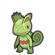
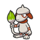
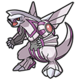
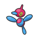
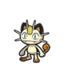
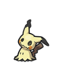
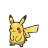
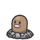

There are 10 flags hidden in this website. Can you find them all?

A flag is any string that follows this format:

```plaintext
rm[number]:[32-character hex string]
```

As you find flags, store them in the [flag checker](#flag-checker), which will
save your progress in your browser's local storage. Note, the checker will only
validate your flags once you've found all 10. There's a secret prize in store
for you if you managed to find them all!

This challenge is about learning new things and having fun. There are some [hints](#hints) below,
but if you're stuck and need more hints, feel free to [reach out]({{ site.author.x }}).

**Spoiler alert!** This site is open source. Please don't spoil the fun for yourself by digging
through the repo!

To get you started, here's the first flag: <!-- rm0:777fda6c519cd062e6d8414e96a4605e -->

## Flag Checker

Enter your flags without the `rm.:` prefix:

<form id="ctf">
  <div>
    
      <label for="rm{{i}}">rm{{i}}:
      <input required id="rm{{i}}" name="rm{{i}}">
      </label>
    
  </div>
  <div>
    <button id="clear" type="button">Clear</button>
    <button>Submit</button>
  </div>
</form>
<div id="banner"></div>

## Hints

So they're not too obvious, I'll give only one hint per flag... as Pokemons!

<details>
  <summary>Click to reveal!</summary>
  <div id="pokemon">
    
    
    
    
    
    
    
    
    
    
  </div>

  Note, the order is the same as the numbers in the flags.
</details>

## About This CTF

This [capture the flag (CTF)](https://en.wikipedia.org/wiki/Capture_the_flag_(cybersecurity)) is
made just for fun and for educational purposes. It's designed for both CTF newcomers and veterans
looking for a short, cozy challenge. It's inspired by
[Garrit's Challenge](https://garrit.xyz/ctf).

<script type="module" src="/ctf/ctf.js" defer></script>
