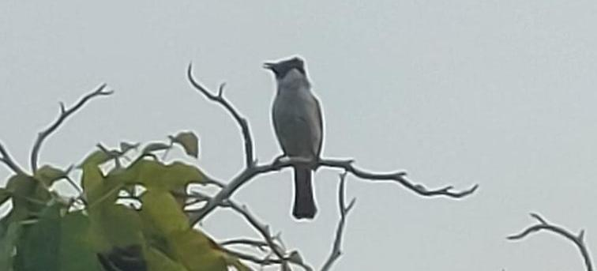

This is my [now page](https://nownownow.com/about), a sporadically updated, append-only log of
things I'm up to right now.

<!-- TODO: uncomment when adding new entry -->
<!-- 
 -->

## March 2026

- Started this now page.
- I've been reading more on PBT/fuzzing, for both testing and security purposes. Thinking of writing
  a fuzzer library that can be used for both, kinda like a mix of
  [Hypothesis](https://hypothesis.works) and [libafl](https://github.com/AFLplusplus/LibAFL), in
  Zig. I haven't built a side project in a while, I hope I can finish it this time.
- My IG feed is now infected with [birding](https://en.wikipedia.org/wiki/Birdwatching) content. It
  sounds like real-life Pokemon, but with only flying types. I might give it a try, though I'm not
  sure my area has much bird variety. I only ever see sparrows, swallows, and pigeons.

  A few days ago, I found a less common bird, which ChatGPT ID'd as the
  [sooty-headed bulbul (*Pycnonotus aurigaster*)](https://ebird.org/species/sohbul1). Here's a
  low-res photo I took of it:

  
